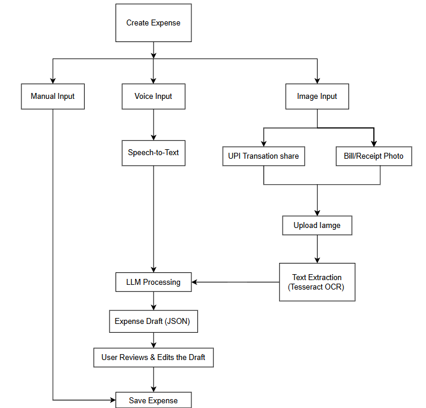

# Smart Expense Tracker 💰

A modern expense management application built with **React Native** and **Express.js** that helps users record, manage, and analyze their daily expenses using multiple smart input methods.

<!-- Instead of manually entering every expense, users can quickly add transactions through voice commands, receipt scanning, or by sharing UPI transaction details from supported payment apps. -->


---

* Add, edit, and delete expenses
* Organize expenses into categories
* Sort and filter expenses

### 📝 Multiple Expense Entry Methods

#### 1. Manual Entry

Quickly enter expenses using a simple and intuitive form.

#### 2. UPI Transaction Sharing

Share transaction details directly from supported UPI apps (such as Google Pay or PhonePe) into the application. The shared text is analyzed and converted into an expense record for user confirmation.

#### 3. Receipt Scanner

Capture or upload a receipt image. **Tesseract OCR** extracts the text, and the system automatically identifies important information such as:

* Merchant
* Amount
* Date
* Suggested category

#### 4. Voice Expense Entry

Simply speak naturally, for example:

> "Spent ₹350 on pizza yesterday."

Speech recognition converts the voice into text, and **Google Gemini API** processes it into a structured expense.

---

## 🏗️ Tech Stack

| Category | Technology / Library |
| :--- | :--- |
| **Mobile (Frontend)** | React Native, TypeScript |
| **Backend API** | Node.js, Express.js, TypeScript |
| **Database** | PostgreSQL |
| **Authentication** | JWT (`jsonwebtoken`, `bcrypt`) |
| **OCR Engine** | Tesseract OCR (`tesseract.js`) |
| **Voice Recognition** | Native Speech Recognition |
| **AI / LLM Processing** | Google Gemini API (`@google/generative-ai`) |

---

## 📂 Project Structure

```text
Advance-Expense-Tracker/
│
├── Backend/
│   ├── src/
│   │   ├── config/          # Database and environment configurations
│   │   ├── controllers/     # Express route controllers
│   │   ├── middlewares/     # Auth, upload, and rate limiting middleware
│   │   ├── models/          # Sequelize database models
│   │   ├── routes/          # Express API route handlers
│   │   ├── seed/            # Category & database seeders
│   │   ├── services/        # Gemini AI & Tesseract OCR services
│   │   ├── types/           # Backend TypeScript types
│   │   ├── uploads/         # Temporary upload directory
│   │   ├── utils/           # Helper functions & utilities
│   │   ├── app.ts           # Express application setup
│   │   └── server.ts        # Server entry point
│   ├── package.json
│   └── tsconfig.json
│
├── Frontend/
│   ├── android/             # Android native platform files
│   ├── ios/                 # iOS native platform files
│   ├── src/
│   │   ├── components/      # UI components
│   │   ├── context/         # Global React context providers
│   │   ├── navigation/      # React Navigation setup
│   │   ├── screen/          # Mobile screens
│   │   ├── theme/           # Styling & theme system
│   │   └── types/           # Frontend TypeScript types
│   ├── App.tsx              # Root component
│   ├── index.js             # React Native entry point
│   └── package.json
│
├── assets/                  # Documentation images & flowcharts
└── README.md
```

---

## 🔄 Expense Creation Flowchart




---

## 🚀 Getting Started & How to Run

### Prerequisites

Ensure you have the following installed on your machine:
* [Node.js](https://nodejs.org/) (v18+ recommended)
* [PostgreSQL](https://www.postgresql.org/) database server running locally or remotely
* [React Native CLI Development Setup](https://reactnative.dev/docs/environment-setup) (Android Studio / Xcode, JDK 17+)
* [Google Gemini API Key](https://aistudio.google.com/)

---

### 1. Clone the Repository

```bash
git clone https://github.com/SamarthBagde/Advance-expense-app.git
cd Advance-expense-app
```

---

### 2. Backend Setup

1. **Navigate to the Backend directory:**
   ```bash
   cd Backend
   ```

2. **Install dependencies:**
   ```bash
   npm install
   ```

3. **Configure Environment Variables:**
   Create a `.env` file in the `Backend` directory:
   ```env
   PORT=3000
   DB_HOST=localhost
   DB_PORT=5432
   DB_NAME=expense_tracker
   DB_USER=postgres
   DB_PASSWORD=your_postgres_password
   JWT_SECRET_KEY=your_jwt_secret_key
   JWT_EXPIRES_IN=7d
   CORS_ORIGIN=*
   GEMINI_API_KEY=your_gemini_api_key
   ```

4. **Seed Database Categories (Optional):**
   ```bash
   npm run seed:categories
   ```

5. **Start the Backend Server:**
   - **Development Mode:**
     ```bash
     npm run dev
     ```
   - **Production Mode:**
     ```bash
     npm run build
     npm run start
     ```
   The backend server will run on `http://localhost:3000`.

---

### 3. Frontend Setup (React Native Mobile App)

1. **Navigate to the Frontend directory:**
   ```bash
   cd ../Frontend
   ```

2. **Install dependencies:**
   ```bash
   npm install
   ```

3. **Configure Environment Variables:**
   Create a `.env` file in the `Frontend` directory:
   ```env
   API_URL=http://<YOUR_LOCAL_IP>:3000/api
   TOKEN_STORAGE_KEY=auth_jwt_token
   ```
   > 💡 *Note: Replace `<YOUR_LOCAL_IP>` with your machine's local Wi-Fi IP address (e.g. `http://192.168.1.5:3000/api`) so physical devices or emulators can connect to the backend.*

4. **Start Metro Bundler:**
   ```bash
   npm start
   ```

5. **Run the App:**
   - **Android:**
     ```bash
     npx react-native run-android
     ```
   - **iOS (macOS only):**
     ```bash
     npx react-native run-ios
     ```

---

## 🎯 Goal

The goal of this project is to make expense tracking fast, intelligent, and effortless by reducing manual data entry while providing meaningful financial insights through modern mobile technologies and AI.

---
